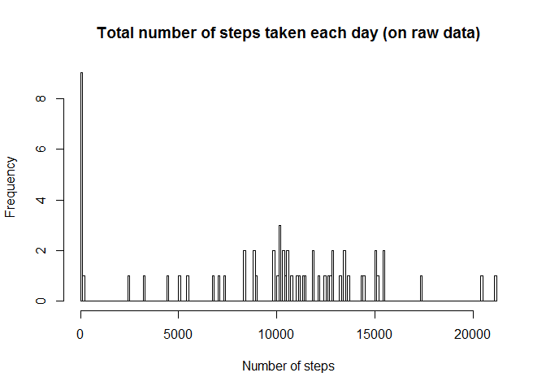
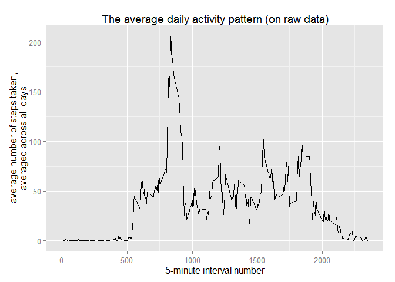
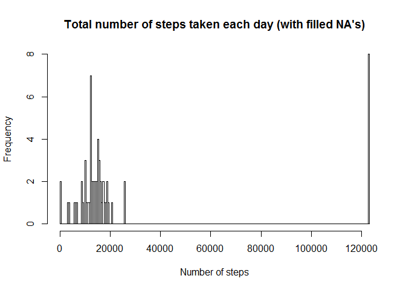
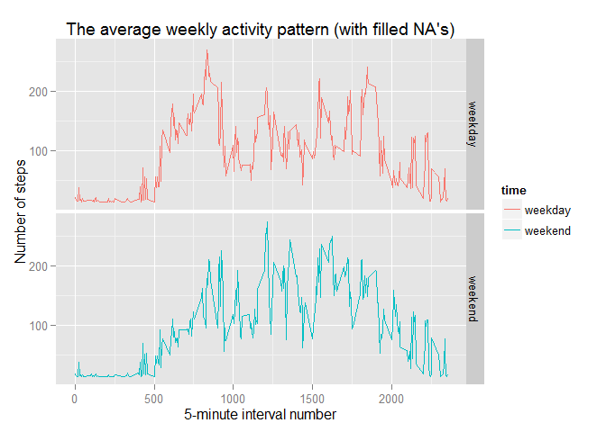

# Reproducible Research: Peer Assessment 1


## Loading and preprocessing the data

```r
unzip(zipfile = "activity.zip", exdir = "data")
activity = read.csv(file = "data/activity.csv")
```


## What is mean total number of steps taken per day?

```r
sumDaily = function(data) {
    per.day = split(x = data, f = data$date)
    total.steps.per.day = vector(mode = "integer")
    for (i in per.day) {
        total.steps.per.day =
            c(total.steps.per.day, sum(as.integer(i$steps), na.rm = T))
    }
    return (total.steps.per.day)
}

summed.daily.activity = sumDaily(activity)

histSumDaily = function(data, desc = NULL) {
    hist(data, breaks = 200,
         main = paste("Total number of steps taken each day", desc),
         xlab = "Number of steps")
}

histSumDaily(summed.daily.activity, "(on raw data)")
```

 

```r
mean.daily.activity = mean(summed.daily.activity)
median.daily.activity = median(summed.daily.activity)
```

Mean total number of steps taken per day is 9354.2295082 and median is 10395.


## What is the average daily activity pattern?

```r
avgDailyTotal = function(data) {
    per.interval = split(x = data, f = data$interval)
    avg.steps.per.itval = data.frame()
    for (i in per.interval) {
        row = c(mean(i$steps, na.rm = T), i$interval[1])
        avg.steps.per.itval = rbind(avg.steps.per.itval, row)
    }
    colnames(avg.steps.per.itval) = c("mean", "id")
    avg.steps.per.itval$id = as.integer(avg.steps.per.itval$id)
    return (avg.steps.per.itval)
}

avg.daily.activity = avgDailyTotal(activity)

plotAvgDaily = function(data, desc = NULL) {
    library(ggplot2)
    qplot(avg.daily.activity$id, avg.daily.activity$mean, geom = "line",
          main = paste("The average daily activity pattern", desc),
          xlab = "5-minute interval number",
          ylab = "average number of steps taken,\naveraged across all days")
}

plotAvgDaily(avg.daily.activity, "(on raw data)")
```

 

```r
max.daily.activity = with(avg.daily.activity, subset(id, mean == max(mean)))
```

On average across all the days in the dataset, the 5-minute interval which contains the maximum number of steps is 835.


## Imputing missing values

```r
total.nas = sum(is.na(activity$steps))
```

There are 2304 missing values in the dataset. The `NA`\`s will be filled by the mean for corresponding 5-minute interval, averaged across all days.

```r
fillNAs = function(data.to.fill, fill.from) {
    filled = as.matrix(data.to.fill)
    for (i in 1:dim(filled)[1]) {
        if (is.na(filled[i, 1])) {
            filled[i, 1] =
                with(fill.from, subset(mean, id == as.integer(filled[i, 3])))
        }
    }
    filled = as.data.frame(filled)
    filled$steps = as.numeric(filled$steps)
    filled$interval = data.to.fill$interval
    return (filled)
}

filled = fillNAs(data.to.fill = activity, fill.from = avg.daily.activity)

summed.filled.activity = sumDaily(filled)

histSumDaily(summed.filled.activity, "(with filled NA's)")
```

 

```r
mean.filled.activity = mean(summed.filled.activity)
median.filled.activity = median(summed.filled.activity)
```

Mean total number of steps taken per day (with filled `NA`\`s) is 2.7560705\times 10^{4} and median is 14321.
These values significantly differ from the estimates from the firts part of the assignement. The mean is 2.9463362 times bigger and median is 1.3776816 times bigger.

Imputing missing data on the estimates of the total number of steps changes the perception of dataset.

## Are there differences in activity patterns between weekdays and weekends?
There can be seen differences in activity patterns between weekdays and weekends.

- on **weekdays** there is more activity in the early hours

- on **weekends** there is more activity through the midday to the evening

```r
makeWeeklyDataset = function(data) {
    days = weekdays(as.Date(data$date), abbreviate = T)
    week = factor(days == "N" | days == "So",
                  levels = c(FALSE, TRUE), labels = c("weekday", "weekend"))
    data.week = data.frame(data, week)

    split.avg.week = with(data.week, split(x = data.week, f = week))
    avg.weekday = avgDailyTotal(split.avg.week[[1]])
    avg.weekend = avgDailyTotal(split.avg.week[[2]])
    avg.weekday$time = rep(1, times = length(avg.weekday$id))
    avg.weekend$time = rep(2, times = length(avg.weekend$id))
    avg.week = rbind(avg.weekday, avg.weekend)
    avg.week$time = factor(avg.week$time,
                           levels = c(1, 2),
                           labels = c("weekday", "weekend"))
    return (avg.week)
}

filled.week = makeWeeklyDataset(filled)

qplot(id, mean, data = filled.week,
      geom = "line",
      facets = time~.,
      color = time,
      main = "The average weekly activity pattern (with filled NA's)",
      xlab = "5-minute interval number",
      ylab = "Number of steps")
```

 
